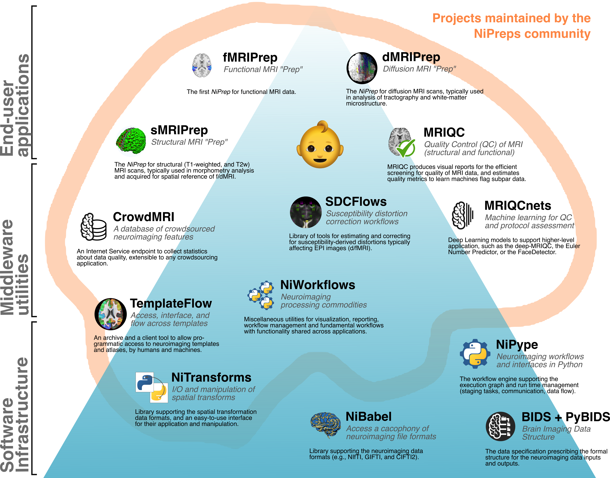

class: center middle

# NiBabies: A robust preprocessing workflow tailored for neonate & infant magnetic resonance imaging

### Mathias Goncalves
#### Center for Reproducible Neuroscience
#### Stanford University

###### [mgxd.github.io/nibabies-2021](https://mgxd.github.io/nibabies-fitng2021)

---
name: footer
layout: true

<div class="slide-slug">NiBabies - FIT'NG - 2021</div>

---

# Outline

1. NiBabies and the NiPreps ecosystem

1. Prerequisites & Installation

1. Usage & Results

1. Future Directions

---

## The NiPreps ecosystem

<div align="center" style="margin-top: 1em">

</div>

---

## The NiPreps ecosystem

<div align="center" style="margin-top: 1em">

</div>

*NiBabies* is the new baby of the *NiPreps* (NeuroImaging PREProcessing toolS) family.

---

## NiBabies

*NiBabies* is a direct descendant of [*fMRIPrep*](https://fmriprep.org/en/stable/), a functional MRI preprocessing pipeline.

--

The widespread adoption of *fMRIPrep* revealed neuroscientists' desires for:
* simplification and standardization of data analysis workflows
* quality assurance visual reporting
* open-source software encouraging discussion and collaboration

--

However, infant MRI presents unique challenges due to head size, as well as rapid shifting in tissue contrast due to myelination.

These challenges require a specialized workflow, extending *fMRIPrep* quality for infant structural and functional MRI.

???

*fMRIPrep* is a great tool for adult MRI acquistions, but ultimately is designed for (and evaluated with) adult datasets.

---
layout: true
template: footer
name: BIDS

## Prerequisites - BIDS

---
layout: true
template: BIDS

.pull-left[]

---

.pull-right[

- *NiBabies* leverages the [Brain Imaging Data Structure (BIDS)](https://bids.neuroimaging.io/) format.
]

--

.pull-right[
- By requiring the data this in this format, the workflow is able to:
    1. Find and retrieve any available data
    1. Alter itself accordingly
]

---

.pull-right[
- When converting a dataset to the BIDS format, we recommend validating with the online [BIDS Validator](https://bids-standard.github.io/bids-validator/).

- Prior to running the workflow, *NiBabies* will run a quick validation to ensure the input dataset is BIDS compliant.
]

???

There are many tools available to facilitate conversion to BIDS format.
- HeuDiConv
- dcm2bids
- BIDScoin
- dcm2niix (low level, used by many under-the-hood)

---

.pull-right[

* The minimal data acquisitions necessary for running *NiBabies* are:
    - T1w (`anat/*T1w.nii.gz`)
    - T2w (`anat/*T2w.nii.gz`)
    - At least one functional (task or resting-state) (`func/*bold.nii.gz`)
]

---
layout: true
template: footer

---

## Installation

### Containers
The easiest way to get started is by using a container service, such as
- *[Docker](https://www.docker.com/get-started)*
- *[Singularity](https://sylabs.io/singularity)*


--

These contained environments come bundled with all necessary underlying software (FreeSurfer, FSL, ANTS, etc) required to use *NiBabies*.

Each release of *NiBabies* produces a tagged image hosted on the cloud.

--

For this example, we will be using Docker.

--

Once Docker is installed, this command will fetch version `21.0.2`.

```Bash
$ docker pull nipreps/nibabies:21.0.2
```

---

## Installation

### nibabies-wrapper
The `nibabies-wrapper` is a useful script to help with the expected syntax when using a container.

It will create, print, and execute the generated command.

--

The script is a lightweight Python 2/3 script. To install or upgrade to the current release:

```Bash
$ python -m pip install --update nibabies-wrapper
```

--

Then, to verify the installation:

```Bash
$ nibabies-wrapper --version
```

---

## Usage

### Required positional arguments
At minimum, the following positional arguments are required:

- `bids directory` - the root folder of a BIDS valid dataset.
- `output directory` - folder to store outputs and reports.
- `analysis level` - processing stage to be run, currently can only be participant.

--

### Recommended flags
However, as infant brains can vastly differ depending on age, providing the following arguments are highly recommended:

- `--age-months` - participant age in months
- `--participant-id` - participant ID (This will process an individual participant and is recommended if age varies across participants)
- `--segmentation-atlases-dir` - directory containing pre-labeled segmentations to use for Joint Label Fusion.

---

## Usage (cont.)

Additionally, *NiBabies* uses FreeSurfer tools, which require a license to run.

To obtain a FreeSurfer license, simply register for free at https://surfer.nmr.mgh.harvard.edu/registration.html.

--

The license can be passed in using the flag `--fs-license-file`.

However, when using the `nibabies-wrapper`, if `$FSLICENSE` is set to the license's path, it will be detected and automatically used.


---

## Sample NiBabies command

We will now be using the `nibabies-wrapper` to generate our command.

Since the `nibabies-wrapper` is capable of producing *Docker* and *Singularity* commands, the container service is also required.

--

```bash
$ nibabies-wrapper \
docker /path/to/data /output/path participant \  # required arguments
--participant-id 01 --age-months 2 \
--segmentation-atlases-dir /path/to/segmentations \
--fs-license-file /path/to/license.txt
```

--

We should get something resembling this:

```bash
RUNNING: docker run --rm -e DOCKER_VERSION_8395080871=20.10.6 -it \
-v /path/to/license.txt:/opt/freesurfer/license.txt:ro \
-v /path/to/data:/data:ro \
-v /output/path:/out \
-v /path/to/segmentations:/opt/segmentations:ro \
nipreps/nibabies:21.0.2 /data /out participant \
--age-months 2 --participant-label 01 \
--segmentation-atlases-dir /opt/segmentations
```
