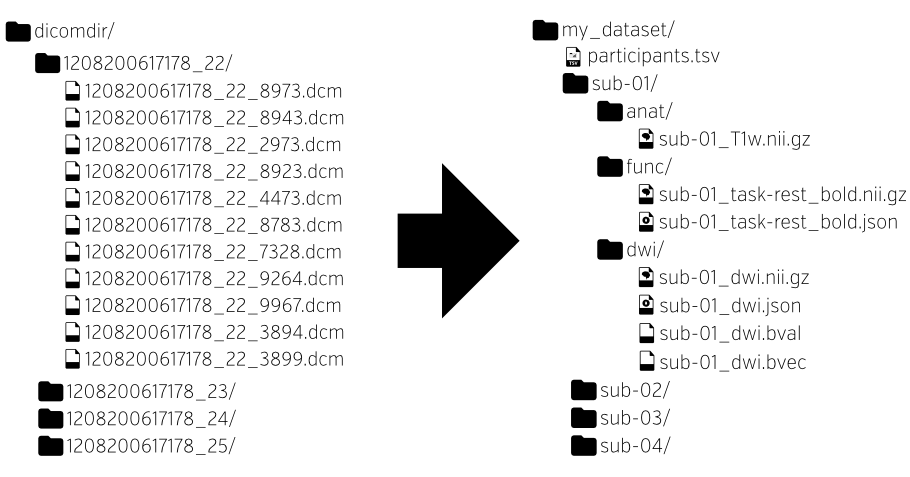

class: center middle

# NiBabies: A robust preprocessing workflow tailored for neonate and infant MRI

### Mathias Goncalves
#### Center for Reproducible Neuroscience
#### Stanford University

###### [mgxd.github.io/nibabies-2021](https://mgxd.github.io/nibabies-2021)

---
name: footer
layout: true

<div class="slide-slug">NiBabies - Nov 2021</div>

---

# Outline

1. The Inspiration for NiBabies

1. Installation & Usage

1. Results

1. Future Directions


---

## Something

Nibabies

---
name: header
layout: true

<div class="slide-slug">The Inspiration for NiBabies</div>

---

## Another thing

something

---
count: false

.pull-right[
* NIfTI headers and JSON sidecars contain detailed,
  image-related metadata
  ```JSON
  {
      "MagneticFieldStrength": 3,
      "Manufacturer": "Siemens",
      "RepetitionTime": 2,
      "PhaseEncodingDirection": "j-"
  }
  ```
* These may contain acquisition parameters, task instructions,
  and relations between scans such as which fieldmaps
  apply to which images.

]

---
count: false

.pull-right[
* Study-level metadata are contained in:
  * [`dataset_description.json`](https://bids-specification.readthedocs.io/en/stable/03-modality-agnostic-files.html#dataset_descriptionjson)
    ```JSON
    { "Name": "My dataset" }
    ```
  * [`participants.tsv`](https://bids-specification.readthedocs.io/en/stable/03-modality-agnostic-files.html#participants-file)
    can encode participant metadata
    ```
    participant_id  age
    sub-01          22
    ```
  * [`sessions.tsv`](https://bids-specification.readthedocs.io/en/stable/06-longitudinal-and-multi-site-studies.html#sessions-file)
    and [`scans.tsv`](https://bids-specification.readthedocs.io/en/stable/03-modality-agnostic-files.html#scans-file)
    can record visit-level and image-level metadata
]

---
layout: true
template: footer

---

# Bidsification

Constructing a BIDS dataset can be tedious and error-prone, so there are several
[converters](https://bids.neuroimaging.io/benefits.html#converters).

<figure style="width: 60%">

</figure>

DICOM images store their relevant metadata internally, but naming conventions tend
to be scanner/institution-specific.

The [Heuristic DICOM Converter](https://heudiconv.readthedocs.io/) (HeuDiConv) and
[bidsify](https://github.com/NILAB-UvA/bidsify) allow you to specify the mapping and
apply in bulk. Both build off of [dcm2niix](https://github.com/rordenlab/dcm2niix/).

---

# Bidsification: ReproIn

The [ReproIn](https://github.com/ReproNim/reproin) project aims to
standardize scanner conventions, to eliminate the need to rewrite these mappings.

<figure style="width: 60%">

<figcaption>From <a href="https://github.com/ReproNim/reproin/blob/master/README.md#overall-workflow">ReproIn</a>;
doi:</figcaption>
</figure>

---

.install-cmd[
```Bash
npm install -g bids-validator
```
]

# BIDS Validator

The machine-readable structure makes validation possible:

```Bash
$ bids-validator /data/bids/openneuro/ds000228
bids-validator@1.5.3

        1: [WARN] Task scans should have a corresponding events.tsv file. If this is a resting state scan you can ignore this warning or rename the task to include the word "rest". (code: 25 - EVENTS_TSV_MISSING)
                ./sub-pixar001/func/sub-pixar001_task-pixar_bold.nii.gz
                ./sub-pixar002/func/sub-pixar002_task-pixar_bold.nii.gz
                ./sub-pixar003/func/sub-pixar003_task-pixar_bold.nii.gz
                ./sub-pixar004/func/sub-pixar004_task-pixar_bold.nii.gz
                ./sub-pixar005/func/sub-pixar005_task-pixar_bold.nii.gz
                ./sub-pixar006/func/sub-pixar006_task-pixar_bold.nii.gz
                ./sub-pixar007/func/sub-pixar007_task-pixar_bold.nii.gz
                ./sub-pixar008/func/sub-pixar008_task-pixar_bold.nii.gz
                ./sub-pixar009/func/sub-pixar009_task-pixar_bold.nii.gz
                ./sub-pixar010/func/sub-pixar010_task-pixar_bold.nii.gz
                ... and 145 more files having this issue (Use --verbose to see them all).
...
```

.center[
## https://bids-standard.github.io/bids-validator/
]

---

# Working with BIDS data

A common specification of neuroimaging datasets affords queries for and
adaptation to the available data.

[PyBIDS](https://github.com/bids-standard/pybids/) is a Python library for
querying and manipulating BIDS datasets.


```Python
>>> from bids import BIDSLayout
>>> layout = BIDSLayout('/data/bids/openneuro/ds000228')
>>> bold = layout.get(subject='pixar002', suffix='bold', extension='.nii.gz')
>>> bold
[<BIDSImageFile filename='/data/bids/openneuro/ds000228/sub-pixar002/func/sub-pixar002_task-pixar_bold.nii.gz'>]
>>> md = bold[0].get_metadata()
>>> md['RepetitionTime']
2
>>> bold[0].get_entities()
{'datatype': 'func',
 'extension': 'nii.gz',
 'subject': 'pixar002',
 'suffix': 'bold',
 'task': 'pixar'}
```

[BIDS-MATLAB](https://github.com/bids-standard/bids-matlab) is a similar project for MATLAB / Octave.

---
layout: true
template: footer
name: Apps

# BIDS Applications

---

Queryable (meta)data allows a very simple protocol for a
[BIDS App](https://bids-apps.neuroimaging.io/apps/):

```Bash
bids-app /bids-directory /output-directory participant [OPTIONS]
```

.footnote[
\* Note that `participant` is an analysis level. Apps may also operate
at the `run`, `session` or `group` levels.
]

--

## Examples

**MRIQC**

```Bash
mriqc /data/bids/openneuro/ds000228 /data/processed/ds000228-mriqc group
```

--

**fMRIPrep**

```Bash
fmriprep /data/bids/openneuro/ds000228 /data/processed/ds000228-fmriprep \
    participant --participant-label pixar001
```

---

.pull-left[
### Many application types are possible
]
.pull-right[
[](https://bids-apps.neuroimaging.io/apps/)
]

---
count: false

.pull-left[
### Many application types are possible

* Quality control

]
.pull-right[
[](https://bids-apps.neuroimaging.io/apps/)
]

---
count: false

.pull-left[
### Many application types are possible

* Quality control

* Anatomical pipelines

]
.pull-right[
[](https://bids-apps.neuroimaging.io/apps/)
]

---
count: false

.pull-left[
### Many application types are possible

* Quality control

* Anatomical pipelines

* Functional pipelines

]
.pull-right[
[](https://bids-apps.neuroimaging.io/apps/)
]

---
count: false

.pull-left[
### Many application types are possible

* Quality control

* Anatomical pipelines

* Functional pipelines

* Diffusion pipelines

]
.pull-right[
[](https://bids-apps.neuroimaging.io/apps/)
]

---
count: false

.pull-left[
### Many application types are possible

* Quality control

* Anatomical pipelines

* Functional pipelines

* Diffusion pipelines

### Lowered friction encourages adoption

* Researchers gain easy access to tools by formatting data
  in BIDS

* Accepting BIDS datasets makes your tools easy to try

]
.pull-right[
[](https://bids-apps.neuroimaging.io/apps/)
]

---
layout: true
template: Apps

---

For development and distribution, BIDS Apps encourages a continuous-integration
(CI) approach.

<figure style="width: 70%">

<figcaption>From doi:</figcaption>
</figure>

--

The uniform interface also eases deployment to HPC or cloud environments like
[CBRAIN](http://mcin.ca/technology/cbrain/) or [AWS Batch](https://aws.amazon.com/batch/).

---

BIDS Apps use the notion of analysis levels, which provide natural opportunities for
parallelism.

<figure style="width: 100%">

<figcaption>From doi:</figcaption>
</figure>

---
layout: true
template: footer

# BIDS Apps and Reproducibility

---

Start-to-finish pipelines aid in performing *reproducible* analyses.

<figure style="width: 60%">

<figcaption>From <a href="https://the-turing-way.netlify.app/reproducible-research/overview/overview-definitions.html#table-of-definitions-for-reproducibility">The
Turing Way, Ch. 2</a>; doi:</figcaption>
</figure>

--

Open analysis on open data is subject to independent reproduction.

--

Accepting BIDS datasets makes *replicating* results on independent data easier.

--

A common interface also makes independent analyses easier to write and compare.

---
layout: true
template: footer
name: Derivatives

# BIDS Derivatives

---

The output of a BIDS App is a *derivative* dataset. The BIDS standard has
[been extended](https://bids-specification.readthedocs.io/en/stable/05-derivatives/01-introduction.html)
to describe "common" derivatives, with a focus on derivatives that
can be reused in yet more BIDS apps.


--

#### Derivative files typically fall into three categories:

1. Preprocessed images (or otherwise transformed data) that can be used for further
  analysis
2. Measures of statistics of interest
3. Figures and reports for assessing the quality of data/processing

--

#### Dataset-level metadata is stored in augmented [`dataset_description.json`](https://bids-specification.readthedocs.io/en/stable/03-modality-agnostic-files.html#derived-dataset-and-pipeline-description):

* `DatasetType` distinguishes `"raw"` and `"derivative"` datasets
* `GeneratedBy` contains references to the code (including version)
  that produced the derivative dataset
* `SourceDatasets` is a list of references to the specific version of the
  dataset analyzed

---

#### Basic metadata remains in filenames

```
fmriprep/sub-01/func/sub-01_task-rest_space-fsaverage_hemi-L_bold.func.gii
fmriprep/sub-01/func/sub-01_task-rest_space-fsaverage_desc-brain_mask.nii.gz
```

Derivatives may have new *entities* (`desc-brain`), *suffixes* (`mask`)
or *extensions* (`.func.gii`).

--

#### Additional metadata in [sidecar JSON files](https://bids-specification.readthedocs.io/en/stable/05-derivatives/02-common-data-types.html#common-file-level-metadata-fields)

* `Description`: natural language description of the file
* `Sources`/`RawSources`: input files to the process that produced the file
* `SpatialReference`: structural images/surfaces needed for interpretation

---

### Common derivatives: [Preprocessed or cleaned data](https://bids-specification.readthedocs.io/en/stable/05-derivatives/02-common-data-types.html#preprocessed-or-cleaned-data)

These data have the same type as the raw inputs. For example:

* Motion-corrected and transformed to MNI space BOLD series
* Time-domain filtered EEG data
* MaxFilter (for example, SSS) cleaned MEG data

To distinguish from the originals, the `space-<label>` and `desc-<label>` may
be used.

Metadata should be retained unless invalidated. For example, `RepetitionTime`
is generally unchanged while `SliceTiming` no longer applies after correction.

--

#### Preprocessed [imaging files](https://bids-specification.readthedocs.io/en/stable/05-derivatives/03-imaging.html#preprocessed-coregistered-andor-resampled-volumes) also have:

* New entities: `res-<label>` and `den-<label>`
* New metadata: `Resolution` and `Density`

---

#### Imaging data types

##### Binary masks

* New suffix: `mask`
* New entity: `label-<label>` for atlas-derived ROIs
* New metadata: `Atlas` for atlas-derived ROIs

--

##### Discrete and probabilistic segmentations

* New suffixes: `dseg` and `probseg`
* New entity: `label-<label>` for probabilistic segmentations
* New metadata: `Manual` (indicates manual or automatic) and `Atlas`

---
layout: true
template: footer
name: Derivatives

# Upcoming BIDS Derivatives

---

##### [BEP 011](https://bids.neuroimaging.io/bep011): Structural derivatives
--

##### [BEP 012](https://bids.neuroimaging.io/bep012): Functional derivatives

--
##### [BEP 014](https://bids.neuroimaging.io/bep014): Affine and non-linear transforms
--

##### [BEP 016](https://bids.neuroimaging.io/bep016): Diffusion weighted imaging derivatives
--

##### [BEP 017](https://bids.neuroimaging.io/bep017): Connectivity data
--

##### [BEP 021](https://bids.neuroimaging.io/bep021): Electrophysiological derivatives
--

##### [BEP 023](https://bids.neuroimaging.io/bep023): PET derivatives

---
layout: true
template: footer

---

# Resources

.left-column-mid[
* [BIDS](https://bids.neuroimaging.io)
   * [Starter Kit](https://github.com/bids-standard/bids-starter-kit)
   * [Specification](https://bids-specification.rtfd.io)
   * [Extension proposals](https://bids.neuroimaging.io/get_involved.html#extending-the-bids-specification)
* [BIDS Validator](https://bids-standard.github.io/bids-validator)
* [BIDS Converters](https://bids.neuroimaging.io/benefits.html#converters)
   * [dcm2niix](https://github.com/rordenlab/dcm2niix/)
   * [HeuDiConv](https://heudiconv.readthedocs.io/)
   * [bidsify](https://github.com/NILAB-UvA/bidsify)
* [PyBIDS](https://github.com/bids-standard/pybids)
   * [Tutorial](https://mybinder.org/v2/gh/bids-standard/pybids/master?filepath=examples%2Fpybids_tutorial.ipynb)
* [BIDS Apps](https://bids-apps.neuroimaging.io/)
   * [Paper](https://doi.org/10.1371/journal.pcbi.1005209)
]
.right-column-mid[
* [ReproNim](https://www.repronim.org/)
   * [ReproIn](https://github.com/ReproNim/reproin)
   * [Neurodocker](https://github.com/ReproNim/neurodocker)
* [The Turing Way](https://the-turing-way.netlify.app/)
]

---
class: center middle

# Thank You

##### [effigies.github.io/bids-incf2021](https://effigies.github.io/bids-incf2021)
